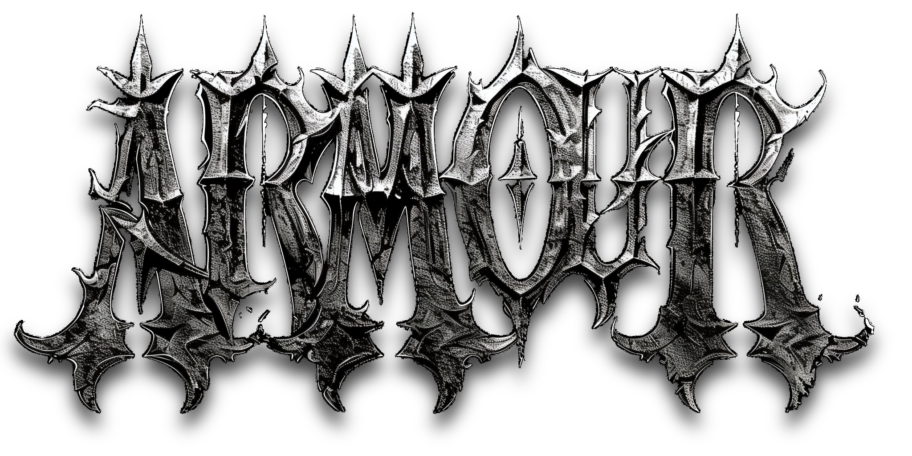

# Unfinished Game Project: ARMOUR

Isometric point & click adventure game, started February 2023. Written in C# for Godot 4. Minimal use of AI.
Couldn't sort enough 3D assets given the scope, so scaled down into a CLI text adventure "armour_v3". Eventually cancelled in favour of a novel.

Was intended for solo dev so the codebase reflects that.