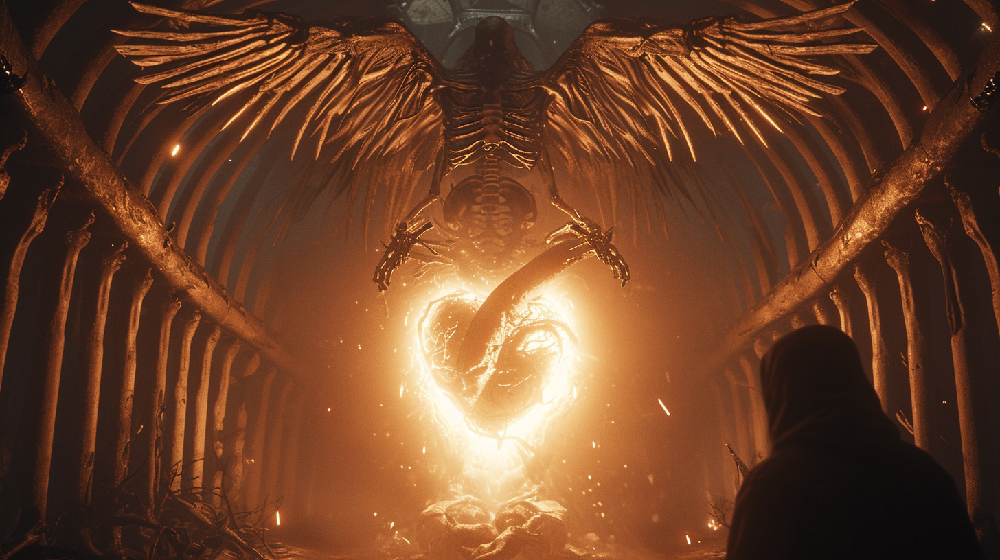

Jesters desecrate a marauders temple. We start with M.M. (already modelled, needs sitting animation, see Img1) sitting in a throne in a desolate temple (enviroment model, see image 2 for reference). It's been desecrated, a lot of graffiti (AI Generated art on walls). The temple has pillars (part of environment model), maybe have tarot symbology on them cause cool (AI art). The floor tiles are red and black marble (AI texture). Also have a stained glass window above the throne, depicting the black hole (AI). We need the temple to look weathered, chips and cracks in environment (AI textures / 3D model weathered design if possible). Decorations like benches and torches (maybe reference an old church). It has to be designed for isometric view, but the angle of the temple is up-down, if you get me (rotated 30 deg from isometric), (see 3rd image). There's the pentagram ritual circle in the middle (already done). Also an stone Altar with red cloth over it, maybe a book and a candle (3D Model + texture by hand, candle particles are handled in engine) (but not really necessary? so low prioritiy). Start with cutscene, jesters laughing noises and things being knocked down noise. Fade in from black to M.M. sitting on his throne with the graffiti behind it, slight zoom in. "Fuck this shit." dialogue pop up. Transition (few options here leave it for later) to outside we see M.M.'s brother (3D model to make, basically the same, bit lankier, taller, camo pants, combat boots, just base it off M.M.'s model) (also they both have matrix code for a face, need a shader for that, For Artist: Copy the mesh for a face as another object, either assign a diff texture to it or export it on its own, Actually I'll have to find out how how blockbench exports materials in Godot). He's tinkering with a motorcycle (Anim, of crouching/tinkering, Also 3D model for the motorcycle. Animatable wheels). That ends cutscene. Player then active in temple, should have a few objects (To add) here where M.M. has some dialogue that shows his personality and adds a bit of context to his living situation. Player then walks through the door of the temple to load outside the temple. (OR: have M.M.s brother motorcycle in as M.M. exits the temple.) (Also: There's already a motorcycle parked outside, M.M.s motorycle. Make it an iconic bike, or literally just base it off Akira's bike cause Akira references are dope).

Img1

Img2

Img3

"Unlucky man" - M.M's brother says as he hops off his motorcycle (Will need a semi-static anim of M.M.'s brother AND M.M. on their motorcycles.) M.M.'s Brother accuses the Black City of the attack, literally the only other living population in the desert besides demons. (They don't really have awareness of the jesters yet, maybe jester reveal and fight at Luh's appearance.) M.M. says he's gonna get his revenge. (Interweave this delicately, character motivation is really important). M.M. states he's gonna get his revenge. His brother then invites M.M. to practice shooting. They ride on their motorcycles to a nearby location (Environmental, suppose it's on a cliff overlooking the black city in the distance). Brother gives him an SMG (3D model), and they practice shooting surveillance birds. (3D model: Need a bird, a crow, with a camera for an eye, maybe even wires coming out of it, a cybernetic bird basically + animated flapping, attack, and death animation, we'll go into details of battle animations a bit later when I figure out how their mechanics.) So that's basically the combat tutorial. (Also M.M's brother needs a walk animation, probably not a run animation idk yet).

So then M.M. sets out to the Black City, encountering demons of the Desert (3D model, see reference, should be spiky, and like 12ft tall. It'll need a run animation, like a skipping gliding, maybe even on all fours depending on size, take creative freedom when you make the demon). (Maybe there's smaller demons and a single larger mini boss demon.) Cutscene after miniboss, start from behind M.M. he looks behind him on the motorbike towards the camera and gives a thumbs up. (Animation, also for dev chuck in the ASCII art of thumbs up cause cool style). 

Then a helicopter (3D model: Helicopter) appears in the sky. Do the kojima zooms. Then helicopter's HUD perspective (shaders blah blah) of M.M. on the motorcycle. "Target acquired" type vibes. Beeps and boops in the sounds. The helicopter lands in front of him. "We need your assistance M.M." (M.M. is a codename for Matrix Marauder, his name will be changed, could even be user inputted name). It's the 6 Dragon team. After being denied entry, he has a chance encounter with a militant order of the Black City. The order’s sole purpose is to find a remedy to a Black City Elite’s immortality. 

They have found a dragon’s skeletal remains in a flowery oasis of the desert. They show drone footage. Then adventure to it fighting desert demons along the way. Inside it’s mouth is a door with glowing matrix hieroglyphics. They task the marauder to open the door as he and the door have a symbiosis. 

Behind the door is a dungeon, and the militant order and marauder team together to extract the heart of the dragon. 

After succeeding, the marauder is invited to a ball hosted by the immortal black city member, and is offered blood. After drinking it, he is sent into a fit of rage, claiming that drinking blood is evil, and the whole city shall perish. After being invigorated by the blood, he fights with militant order. Due to his newfound power, he ignites a black hole at the banquet. The immortal man is sitting up in a balcony, it shows him leaving swiftly and calmy escorted by men in suits.

Escape sequence by motorcycle, environmental hazards.

He returns to the temple, which has been become burning ruins. His brother is dead in the burning temple. Awaiting him is an ambush of jesters. 

A world receiver called luh, a highly skilled assassin who perpetuates balance in the world, joins in on the fight and does away with the jesters. She scolds and condemns the marauder for being so reckless, and tells him he has no idea what his role is in this play. 

From a distance we see the black hole leaving a huge crater in the desert, revealing a huge pyramid that was under the Black City. The jesters come together to close the black hole. A guardian of the pyramid is summoned, and defeats the marauder, executing him, ripping his spine out and drinking from it. 

Thus concludes the ARMOUR story, leaving way for the next game, DNSCRYPT. Post credits: In a realm between life and death, the marauders soul is fished out of a river of the dead by a nurse. A living carcass of a WW2 fighter pilot sings an apocalyptic hymn to his soul, and resuscitates him.
